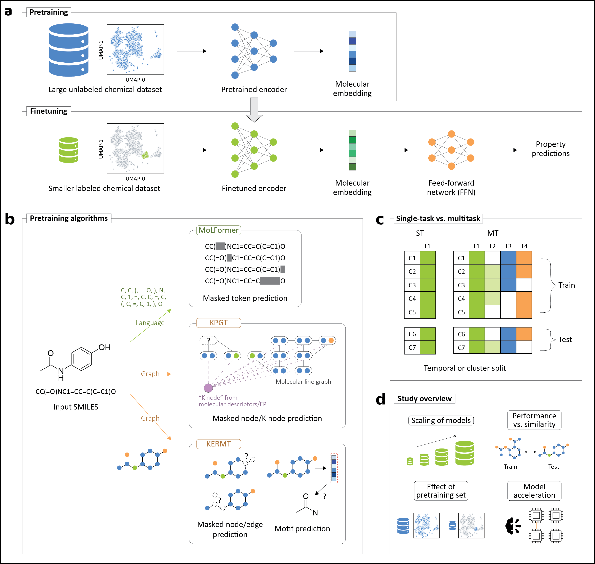

<h1 align="center">KERMT</h1>

本家KERMT（[リンク](https://github.com/NVIDIA-Digital-Bio/KERMT)）に独自の改良を加えました。
* MTL (Multi-Task Learning) 実行時にタスクごとの重み付けができるように変更しました
* HPO Finetuning 実行時の挙動を変更しました
  - `fine_tune_coff` を HPO 探索対象に追加しました（事前学習済み本体の学習率スケーリング）
  - データ数に応じてデフォルトの探索範囲を定義しました（`configs/hpo/finetune_[size].json`）
  - `--hpo_profile small|medium|large` により簡易的に設定することができます

> 以下のREADMEは、オリジナルの内容をベースに一部改変しています

---

This is the official code repository for the paper titled [Multitask finetuning and acceleration of chemical pretrained models for small molecule drug property prediction](https://arxiv.org/abs/2510.12719).

<p align="center">
    
</p>


**K**inetic GROV**ER** **M**ulti-**T**ask (KERMT) is a pretrained graph neural network model for molecular property prediction.

KERMT is an enhanced reimplementation of the [GROVER](https://arxiv.org/abs/2007.02835) model. The KERMT implementation uses PyTorch Distributed Data Parallel (DDP) for distributed pretraining,  automates hyperparameter tuning, and accelerates finetuning and prediction using [cuik-molmaker](https://github.com/NVIDIA-Digital-Bio/cuik-molmaker).

This implementation is based on the [original GROVER implementation](https://github.com/tencent-ailab/grover) and [paper](https://arxiv.org/abs/2007.02835).

## Requirements
We recommend using a Docker container for running the model. For developers, we have provided a Dockerfile that was used to create the container.

## Setup

#### Clone the repository
```bash
git clone https://github.com/NVIDIA-Digital-Bio/KERMT.git
cd KERMT
```

#### Build the container
```bash
docker build --rm -t kermt:latest -f Dockerfile .
```

#### Run the container with GPUs
```bash
docker run --rm --gpus all --ipc=host --ulimit memlock=-1 --ulimit stack=67108864 -v /path/to/data:/data -v /path/to/reference_pretrained_models:/reference_pretrained_models -it --name kermt  kermt:latest

source /softwares/miniconda3/etc/profile.d/conda.sh && conda activate kermt
cd code
```

### Setup environment
```bash
export PYTHONPATH=$PWD
export CUBLAS_WORKSPACE_CONFIG=:4096:8 # for deterministic results
```

#### [Alternative to Docker container] Install conda environment from file
```bash
# Create conda environment
cd KERMT
conda env create -n kermt -f environment.yml
conda activate kermt

# Install cuik-molmaker
pip install cuik_molmaker==0.1.1 --index-url https://pypi.nvidia.com/rdkit-2025.03.2_torch-2.7.1/
```

## Pretained Model Download
The pretrained models models can be downloaded from the following links. 
   - [GROVER<sub>base</sub>](https://1drv.ms/u/s!Ak4XFI0qaGjOhdlwa2_h-8WAymU1AQ)
   - [GROVER<sub>large</sub>](https://1drv.ms/u/s!Ak4XFI0qaGjOhdlxC3mGn0LC1NFd6g) 


## Pretraining
#### Data Preparation
Prepare data by generating task labels for functional group prediction task. The SMILES string should be present in a CSV file with a column named `smiles`. See `tests/data/smis_only.csv` for an example.
```bash
python scripts/save_features.py --data_path tests/data/smis_only.csv  \
                                --save_path tests/data/smis_only.npz   \
                                --features_generator fgtasklabel \
                                --restart
```

#### Atom/Bond Contextual Property (Vocabulary)
The atom/bond Contextual Property (Vocabulary) is extracted by `scripts/build_vocab.py`.
 ```bash
python scripts/build_vocab.py --data_path tests/data/smis_only.csv  \
                              --vocab_save_folder tests/data/smis_only  \
                              --dataset_name smis_only
 ```
The outputs of this script are vocabulary dicts of atoms and bonds, `smis_only_atom_vocab.pkl` and `smis_only_bond_vocab.pkl`, respectively. For more options for contextual property extraction, please refer to `scripts/build_vocab.py`.

#### Data Splitting
Split pretraining data and features into smaller files for memory efficiency.
```bash
python scripts/split_data.py --data_path tests/data/smis_only.csv  \
                             --features_path tests/data/smis_only.npz  \
                             --sample_per_file 100  \
                             --output_path tests/data/smis_only
```
It is recommended to set `sample_per_file` to a larger value for big datasets. 

The output dataset folder will look like this:
```
smis_only
  |- feature # the semantic motif labels
  |- graph # the smiles
  |- summary.txt
```

#### Running Pretraining
For pretraining on multiple GPUs, set available number of GPUs as `WORLD_SIZE`. As pretraining datasets are large, it is recommended to use a large batch size and ensure near-full GPU memory utilization for maximum efficiency. This example shows how to pretrain on 2 GPUs on a prepared pretraining dataset in the `tests/data/pretrain` directory.
```bash
WORLD_SIZE=2 python pretrain_ddp.py  \
    --train_data_path tests/data/pretrain/train_9k \
    --val_data_path tests/data/pretrain/val_1k \
    --save_dir model/pretrain \
    --atom_vocab_path tests/data/pretrain/pretrain_atom_vocab.pkl \
    --bond_vocab_path tests/data/pretrain/pretrain_bond_vocab.pkl \
    --batch_size 256   --dropout 0.1 --depth 6 --num_attn_head 4 --hidden_size 800 \
    --epochs 100 --init_lr 1E-5 --max_lr 1.5E-4 --final_lr 1E-5 --warmup_epochs 20 \
    --weight_decay 1E-7 --activation PReLU --backbone gtrans --embedding_output_type \
    both  --tensorboard --save_interval 100 --use_cuikmolmaker_featurization
```
For preparing your own pretraining dataset, please run the [Data Preparation](#data-preparation), [vocabulary generation](#atombond-contextual-property-vocabulary), and [data splitting](#data-splitting) sections above.

## Finetuning
The dataset for finetuning should be organized into three `.csv` files for train, validation, and test sets. Each of the `.csv` files should contain a column named as `smiles` and columns for prediction tasks. See `tests/data/finetune/` for examples.


#### (Optional) Molecular feature extraction
Given a labelled molecular dataset, it is possible to precompute additional molecular features required to finetune the model from the existing pretrained model. The feature matrix is stored as `.npz`. This examples shows how to precompute normalized RDKit 2D features for training dataset. This step should be repeated for validation and test datasets.
``` bash
python scripts/save_features.py --data_path tests/data/finetune/train.csv \
                                --save_path tests/data/finetune/train.npz \
                                --features_generator rdkit_2d_normalized \
                                --restart 
```


#### Finetuning with labelled data
```bash
python main.py finetune \
    --data_path tests/data/finetune/train.csv \
    --separate_val_path tests/data/finetune/val.csv \
    --separate_test_path tests/data/finetune/test.csv \
    --save_dir test_run/finetune \
    --checkpoint_path reference_pretrained_models/grover_base.pt \
    --dataset_type regression \
    --split_type scaffold_balanced \
    --ensemble_size 1 \
    --num_folds 1 \
    --no_features_scaling \
    --ffn_hidden_size 700 \
    --ffn_num_layers 3 \
    --bond_drop_rate 0.1 \
    --epochs 2 \
    --metric mae \
    --self_attention \
    --dist_coff 0.15 \
    --max_lr 1e-4 \
    --final_lr 2e-5 \
    --dropout 0.0 \
    --use_cuikmolmaker_featurization \
    --features_generator rdkit_2d_normalized_cuik_molmaker \
    --rdkit2D_normalization_type fast \
```
`--task_weights` can be used to set per-task loss weights (e.g., `--task_weights 1.0 0.5 2.0`). The number of weights must match the number of target columns.
`--use_cuikmolmaker_featurization` flag is used to enable `cuik-molmaker` for computing atom and bond features. Additionally, normalized RDKit 2D features can also be computed using `cuik-molmaker` by setting `--features_generator rdkit_2d_normalized_cuik_molmaker`. `--rdkit2D_normalization_type` is used to specify the type of normalization that should be applied to RDKit 2D features.

#### Finetuning with hyperparameter optimization
```bash
python main_hpo.py finetune --data_path tests/data/finetune/train.csv \
                            --features_path path/to/train.npz \
                            --separate_val_path tests/data/finetune/val.csv \
                            --separate_val_features_path  path/to/val.npz \
                            --separate_test_path tests/data/finetune/test.csv \
                            --separate_test_features_path  path/to/test.npz \
                            --save_dir finetune_hpo/ \
                            --checkpoint_path reference_pretrained_models/grover_base.pt \
                            --dataset_type regression \
                            --split_type scaffold_balanced \
                            --ensemble_size 1 \
                            --num_folds 1 \
                            --no_features_scaling \
                            --weight_decay 5e-06 \
                            --fine_tune_coff 1.0 \
                            --epochs 100 \
                            --n_trials 100 \
                            --metric mae \
                            --self_attention \
                            --hpo_profile medium
```
The number of trials can be set using `--n_trials` flag and the number of epochs per trial can be set using `--epochs` flag.

The HPO search range can be selected without editing `main_hpo.py`:
- Built-in profiles: `--hpo_profile small|medium|large`
- Custom config file: `--hpo_config_path path/to/hpo_space.json`

Three built-in profile files are available:
- `configs/hpo/finetune_small.json`
- `configs/hpo/finetune_medium.json`
- `configs/hpo/finetune_large.json`

`fine_tune_coff` is also optimized in the built-in profiles:
- small: `[0.0, 0.1, 0.25, 0.5, 0.75]`
- medium: `[0.25, 0.5, 0.75, 1.0]`
- large: `[0.5, 0.75, 1.0]`

Example using a custom config:
```bash
python main_hpo.py finetune --data_path tests/data/finetune/train.csv \
                            --separate_val_path tests/data/finetune/val.csv \
                            --separate_test_path tests/data/finetune/test.csv \
                            --save_dir finetune_hpo_custom/ \
                            --checkpoint_path reference_pretrained_models/grover_base.pt \
                            --dataset_type regression \
                            --split_type scaffold_balanced \
                            --ensemble_size 1 \
                            --num_folds 1 \
                            --no_features_scaling \
                            --epochs 100 \
                            --n_trials 100 \
                            --metric mae \
                            --self_attention \
                            --hpo_config_path configs/hpo/finetune_large.json
```

## Prediction
A finetuned model can be used to make predictions on target molecules.

#### Prediction with Finetuned Model
``` bash
python main.py predict \
    --data_path tests/data/finetune/test.csv \
    --checkpoint_dir path/to/finetuned_model/ \
    --no_features_scaling \
    --output path/to/predictions.csv
```

## Hardware Requirements
- GPUs are required for pretraining, finetuning, and prediction. Multiple GPUs can be used for distributed pretraining. NVIDIA GPUs with atleast 32GB of vRAM and Volta or newer architectures is recommended.


## References
- Paper:[Multitask finetuning and acceleration of chemical
pretrained models for small molecule drug
property prediction](https://arxiv.org/abs/2510.12719)
- Dataset: [Figshare link](https://figshare.com/articles/dataset/Datasets_for_Multitask_finetuning_and_acceleration_of_chemical_pretrained_models_for_small_molecule_drug_property_prediction_/30350548/2)
- [Original GROVER paper](https://arxiv.org/abs/2007.02835)
- [Original GROVER implementation](https://github.com/tencent-ailab/grover)
